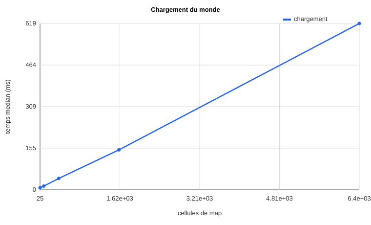
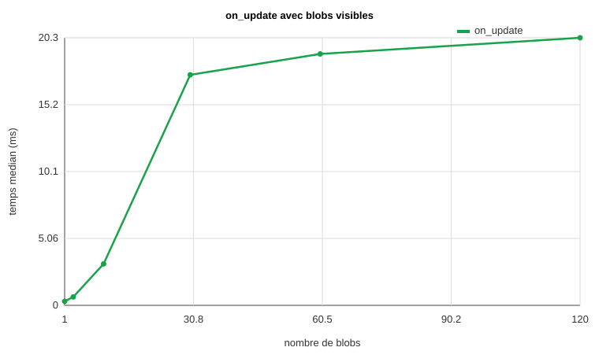
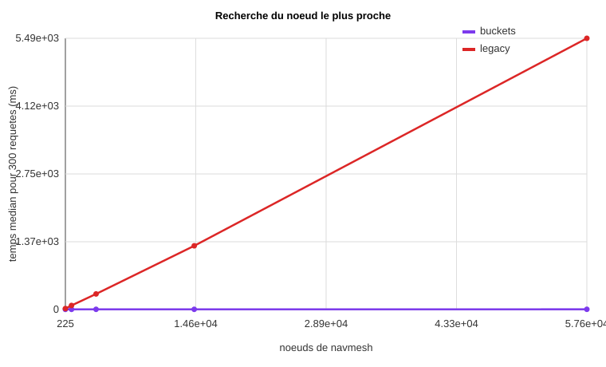

# Document de conception - Jeu d'Adventure 2D

Ce document décrit les choix d'architecture du projet. Il ne liste pas tous les
fichiers: l'objectif est d'expliquer les responsabilités, les frontières entre
objets et les invariants que le code essaie de préserver.

## Vue d'ensemble

Le jeu est organisé autour d'une séparation volontaire entre trois moments:
charger une carte, construire le monde jouable, puis orchestrer une frame.

```
main.py
  -> WorldBuilder.build_from_file(...)
       -> Map
       -> LoadedWorld
  -> GameView(loaded_world, file_map)
       -> on_update(...)
       -> on_draw(...)
```

`Map` est une représentation validée du niveau. `WorldBuilder` transforme cette
description en objets Arcade et en objets métier. `GameView` reçoit un
`LoadedWorld` déjà construit et se concentre sur la boucle de jeu: entrées,
physique, collisions, transitions, rendu et interface utilisateur.

Ce choix évite deux extrêmes. `GameView` ne devient pas un constructeur géant qui
parse les fichiers et instancie tout le monde. `WorldBuilder`, de son côté, ne
devient pas un moteur de jeu caché: il construit, puis il s'arrête.

## Construction du monde

`LoadedWorld` est un conteneur immuable au sens structurel: il référence les
objets principaux du niveau, mais ne décide pas comment ils évoluent. Il contient
notamment la `Map`, le navmesh, les `SpriteList` explicites, le joueur, les
armes et le contrôleur d'armes.

Les `SpriteList` sont volontairement exposées par rôle (`grounds`, `walls`,
`mobs`, `crystals`, `weapons`, etc.). Ce choix est plus direct qu'un conteneur
intermédiaire de type `SpriteGroups`: l'ordre d'update et de rendu reste visible
dans `GameView`, comme dans la correction du cours. Les listes ne portent pas de
logique métier; elles servent à stocker, dessiner, animer et tester les
collisions.

`WorldBuilder` est responsable de tout ce qui dépend de la carte initiale:
création des sprites de décor, placement du joueur, création des monstres,
construction des portails, préparation du navmesh et initialisation des armes.
Les erreurs de cohérence détectables au chargement doivent être levées ici ou
dans `Map`: portail sans configuration, levier absent, symbole invalide, position
incohérente, etc.

## Carte et validation

Le fichier de map mélange deux niveaux d'information:

- Une grille lisible par symbole, qui décrit le terrain et les entités posées sur
  les cases.
- Une configuration YAML optionnelle, utilisée pour les objets qui ont besoin de
  données supplémentaires, comme les leviers, les portails ou la carte suivante.

La classe `Map` ne doit pas seulement parser du texte. Elle défend les invariants
du niveau: dimensions exactes, symboles connus, position de départ unique,
coordonnées valides, références cohérentes entre configuration et grille. Cette
validation précoce rend le reste du programme plus simple: `WorldBuilder` peut
construire le niveau en supposant que la structure générale est déjà saine.

## GameView

`GameView` est l'orchestrateur de la frame, pas le propriétaire de toutes les
règles métier. Son constructeur reçoit un `LoadedWorld`; les constructeurs
nommés `from_file`, `from_map` et `from_string` ne sont que des raccourcis pour
les tests ou le lancement du jeu.

Ses responsabilités principales sont:

- Traduire les entrées clavier en appels métier sur le joueur ou les armes.
- Appeler explicitement les updates importants dans un ordre stable.
- Appliquer les effets produits par les armes.
- Maintenir les collisions globales: joueur contre murs, trous, monstres,
  cristaux, sorties.
- Gérer l'UI, la caméra, le score, la vie et les changements de niveau.
- Dessiner les listes de sprites dans un ordre lisible.

La boucle `on_update` est volontairement explicite. Les monstres ne sont pas
pilotés par une méthode générique cachée sur une collection: `GameView` appelle
`update_monster(...)`, ce qui rend visible le fait que les ennemis ont des règles
de déplacement propres. Les armes suivent la même logique: le contrôleur d'armes
produit des effets, puis `GameView` les applique au monde.

## Joueur

`Player` représente l'état local du joueur: direction regardée, touches de
direction actuellement pressées, vitesse et animation. Les détails internes comme
les directions pressées doivent rester encapsulés. Le reste du programme demande
au joueur de changer d'état via des méthodes explicites plutôt que de modifier
directement ses attributs internes.

Le point important est la cohérence temporelle: quand une direction est pressée
ou relâchée, la direction regardée et le mouvement doivent être recalculés tout
de suite. Ainsi, si le joueur change de direction puis utilise une arme dans la
même frame, l'arme part dans la bonne direction.

## Armes

Les armes sont modélisées comme des objets métier et non comme de simples
sprites. Une arme possède un ou plusieurs sprites, mais son état, son cycle de
vie et ses règles d'utilisation restent dans la classe d'arme.

`WeaponController` centralise l'arme active, le changement d'arme et la mise à
jour des armes. Il expose aussi l'information `locks_player`, utilisée par
`GameView` pour bloquer temporairement le mouvement pendant certaines attaques.

Les interactions avec le monde passent par des objets `WeaponEffect`, par
exemple `HitTarget`, `ToggleLever` ou `CollectCrystal`. Ce choix évite de donner
aux armes un accès direct à toute la vue. L'arme détecte ce qu'elle provoque;
`GameView` applique ensuite les conséquences globales comme le score, les sons,
les portails ou la suppression d'un ennemi.

## Monstres et navigation

Les monstres partagent une interface commune: ils peuvent être mis à jour par
`update_monster(delta_time, player_position)` et peuvent infliger des dégâts au
contact. Les spinners ont un mouvement borné par la carte. Les chauves-souris ont
une patrouille locale. Les blobs utilisent le navmesh pour se déplacer vers le
joueur quand il devient pertinent de le faire.

Le navmesh est construit au chargement à partir de la map. Cette décision déplace
un coût vers le chargement, mais simplifie les updates des monstres: ils
travaillent sur une structure déjà prête au lieu de reconstruire des chemins à
partir de la grille brute.

## Portails et leviers

Les leviers et portails sont des objets du monde, mais l'évaluation globale de
leur état reste dans `GameView`. Lorsqu'une arme active un levier, `GameView`
met à jour l'état connu des leviers, déplace les portails entre les listes
ouvertes et fermées, puis reconstruit la liste d'obstacles utilisée par le moteur
physique.

Cette organisation garde une frontière claire: un levier connaît son état, un
portail sait déterminer s'il doit être ouvert ou fermé, mais seul `GameView`
coordonne les conséquences globales dans la frame courante.

## Tests

Les tests suivent la même séparation que l'architecture.

- Les tests de `Map` vérifient le parsing et la validation sans fenêtre Arcade.
- Les tests de `WorldBuilder` vérifient la construction d'un `LoadedWorld`
  cohérent à partir d'une carte valide.
- Les tests de `Player`, armes et monstres ciblent les comportements métier avec
  le moins de dépendances possible.
- Les tests de `GameView` restent des tests d'intégration: clavier, boucle
  Arcade, collisions globales, transitions de map.

Cette séparation évite de tester un détail de parsing dans un test d'arme, ou un
détail de fenêtre Arcade dans un test unitaire de monstre.

## Performances

Les mesures sont produites par `benchmarks/performance_benchmark.py`. Le script
construit des cartes programmatiquement, mesure des temps médians avec
`time.perf_counter()`, écrit les CSV dans `benchmarks/results/`, puis génère des
graphes SVG. Pour `on_update`, le benchmark appelle manuellement la logique de
frame; il n'utilise pas `window.test()`, car cette méthode laisse réellement
passer le temps horloge. Comme l'environnement de benchmark n'a pas de fenêtre
Arcade fiable, le script mesure la partie métier de `GameView.on_update` sur un
`LoadedWorld` déjà construit et exclut seulement caméra/UI/fps, dont le coût ne
dépend pas du facteur choisi.

### Chargement d'une map

Facteur choisi: le nombre de cellules de la map, noté `M = largeur * hauteur`.
Dans nos cartes de benchmark, toutes les cellules sont du sol et le nombre de
noeuds de navmesh par cellule reste constant. Le parsing du texte de map parcourt
les `M` cellules, donc il est en `Theta(M)`. La création des sprites de terrain
par `WorldBuilder` parcourt aussi les cellules et reste en `Theta(M)`.

La partie la plus intéressante est la construction du navmesh. Si `k` désigne le
nombre de noeuds de navmesh placés dans une cellule, alors le nombre total de
noeuds vaut environ `V = M * k`. La construction vérifie les noeuds et crée des
arêtes locales entre voisins proches; comme le nombre de voisins possibles autour
d'un noeud est borné par une constante, on obtient `E = Theta(V)`. Pour une
densité de navmesh fixée, `k` est constant, donc le chargement est grossièrement
en `Theta(M)`. Si on augmentait la densité de navmesh en même temps que la taille
de map, le terme `k` deviendrait visible et le coût serait plutôt `Theta(M * k)`.

Le spatial hash utilisé pour `closest_node` est construit pendant le chargement.
Cette construction ajoute chaque noeud une fois dans un dictionnaire de buckets,
donc elle reste en `Theta(V)`. Son intérêt n'est donc pas de rendre le chargement
asymptotiquement plus rapide, mais de déplacer un petit coût au chargement pour
éviter de reparcourir tout le navmesh à chaque recherche pendant le jeu.



| Cellules | Noeuds navmesh | Temps median |
|----------|----------------|--------------|
| 25       | 225            | 7.48 ms      |
| 100      | 900            | 13.79 ms     |
| 400      | 3600           | 42.31 ms     |
| 1600     | 14400          | 148.48 ms    |
| 6400     | 57600          | 618.62 ms    |

Les mesures sont cohérentes avec l'analyse `Theta(M)`: multiplier la taille par
4 multiplie globalement le temps par un facteur proche de 3 à 4 sur les grandes
cartes. Les petites cartes ont un coût fixe visible, dû au parsing, aux objets
Python et à la création des `SpriteList`, ce qui explique que la progression ne
soit pas parfaitement proportionnelle au début.

### `on_update`

Facteur choisi: le nombre de blobs visibles, noté `B`, sur une map de taille
fixe. Ce facteur est pertinent car un blob visible peut recalculer un chemin vers
le joueur. Le reste de la frame contient des traitements assez directs: update du
joueur, physique, animations, collisions et armes. Pour une map fixée et peu de
projectiles, ces traitements croissent surtout avec le nombre de sprites actifs.

Pour chaque blob, la partie coûteuse est le pathfinding. Le blob doit rattacher sa
position et celle du joueur au navmesh avec `closest_node`, puis chercher un
chemin dans le graphe. Avec l'ancienne version `closest_node_legacy`, chaque
rattachement coûtait `Theta(V)` car on parcourait tous les noeuds. Avec le
spatial hash, on regarde d'abord les buckets proches; sur une map régulière,
c'est proche d'un coût constant moyen, même si le pire cas reste moins favorable
si beaucoup de noeuds tombent dans les mêmes buckets. Ensuite, la recherche de
chemin dans le graphe dépend du nombre de noeuds et d'arêtes explorés; sur une map
fixée, ce coût est borné par une constante par blob.

Pour une map fixée, on s'attend donc à une croissance grossièrement linéaire en
`B` tant que les blobs déclenchent effectivement un calcul similaire:
`Theta(B * C_path)`, où `C_path` est le coût moyen d'un calcul de chemin sur
cette map. Le spatial hash est important ici: il évite que le simple rattachement
au navmesh ajoute un coût proportionnel à toute la taille du graphe pour chaque
blob et chaque frame.



| Blobs | Temps median |
|-------|--------------|
| 1     | 0.30 ms      |
| 3     | 0.64 ms      |
| 10    | 3.14 ms      |
| 30    | 17.45 ms     |
| 60    | 19.03 ms     |
| 120   | 20.26 ms     |

La croissance est nette jusqu'à 30 blobs, puis elle plafonne. Cela reste
compatible avec l'analyse grossière: le coût augmente quand davantage de blobs
font un vrai travail de déplacement/pathfinding, mais les blobs ajoutés ensuite
ne produisent pas tous un calcul aussi coûteux dans la frame mesurée. Les
collisions, les animations et les updates simples restent moins visibles que les
calculs de chemin.

### Mesure complémentaire: `closest_node`

Comme `closest_node` est appelé par le pathfinding des blobs, nous avons aussi
mesuré 300 recherches du noeud de navmesh le plus proche, avec et sans spatial
hash.



| Noeuds navmesh | Buckets | Legacy | Gain |
|----------------|---------|--------|------|
| 225            | 3.86 ms | 20.16 ms | x5.23 |
| 900            | 4.25 ms | 82.87 ms | x19.51 |
| 3600           | 4.88 ms | 316.37 ms | x64.88 |
| 14400          | 4.75 ms | 1291.03 ms | x271.76 |
| 57600          | 5.25 ms | 5493.11 ms | x1047.04 |

Cette mesure explique pourquoi le spatial hash est utile même si sa construction
ajoute un peu de travail au chargement. La version legacy croît presque
linéairement avec `V`, car chaque requête inspecte tous les noeuds. La version
par buckets reste presque stable dans ces cartes régulières, car elle inspecte
seulement quelques buckets autour de la position cherchée.
